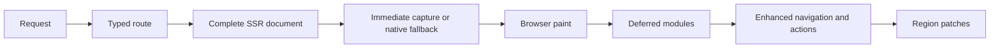

# Harch Web

[![CI][ci-badge]][ci] [![Coverage][coverage-badge]][coverage]

Harch Web is an SSR-first, progressively enhanced web architecture for Haskell. Every supported route
returns a complete HTML document, while a deliberately small browser layer adds SPA-style navigation,
typed client actions, region patches, and live updates after the first page is already useful.

Run the smallest application from the repository root:

```sh
cabal run two-pages-example
```

Then open <http://127.0.0.1:8080/>. See [SETUP.md](SETUP.md) for development prerequisites and the
[two-pages guide](examples/two-pages/README.md) for the executable walkthrough.

## How a request becomes an application



Every route is usable as HTML before the optional application runtime arrives. Native links remain
links, and modeled framework forms have an event path as soon as their controls can be used. Deferred
modules then upgrade navigation and mutations without recreating the component tree in the browser.

That design is intended to improve first-content conditions, not to promise a benchmark result. SSR
often improves First Contentful Paint by avoiding client-side data and templating round trips, but
dynamic server work can increase Time to First Byte. Measure the application and deployment that you
actually ship.

## What is included

- Generated page-route algebras, exhaustive dispatch, explicit dynamic/API routes, and typed URL
  rendering.
- XML-like, escaping-by-default markup whose components are ordinary typed Haskell functions.
- A nonce-protected immediate capture kernel, deferred navigation, typed client actions, region
  patches, and Server-Sent Events (SSE).
- Typed PostgreSQL effects and migrations, with an app-owned adapter seam for other databases or data
  sources.
- OTLP traces and metrics, low-cardinality route naming, and stable expected-error classification.
- Opaque sessions, CSRF protection, Argon2id credentials, TOTP/MFA, email seams, and typed middleware.
- Manual or shared certificates, ACME/Let's Encrypt through certbot, HSTS, CSP, CORS, redirects, and
  constrained static-asset serving.
- Localization, reverse-proxy and path-prefix handling, semantic accessibility conventions,
  warning-free optimized builds, 100% per-package coverage, and real-browser tests.

## How Harch differs from common rendering architectures

> **A control that looks enabled has invited interaction. If its handler does not exist yet, a real
> user can lose a click or submit—and an end-to-end test can fail for exactly the same reason.**

This is the practical hydration gap. The broader [web.dev rendering analysis][rendering-web] explains
that hydrated SSR displays server HTML and
then runs client code to add interactivity. On constrained devices, the visible page can therefore
precede the handlers that make it interactive. The inference is specific: if a visible control depends
only on a handler that hydration has not attached and has no native fallback, that control cannot yet
perform its advertised action.

### React Server Components and Next.js

React Server Component pages use Client Components where event handlers are needed. Next.js describes
the initial HTML as a non-interactive preview and says hydration attaches event handlers to make it
interactive in its [Server and Client Components guide][next-components]. It follows that an ordinary
button backed only by a Client Component handler can be visible before that handler is available.

There is an important mitigation, not a universal loss condition: Next Server Actions, built on React
Server Functions, and selected form integrations can progressively submit, redirect, queue, or replay
submissions made before hydration. See [React Server Functions][react-functions]. That protects those
modeled Server Action forms; it does not attach arbitrary client-only handlers early.

### SvelteKit

SvelteKit makes the same useful distinction. Its native [form actions][svelte-actions] work without
JavaScript and may then be progressively
enhanced. Custom client event handlers still require hydration.

A report from a SvelteKit project with 6,159 Playwright tests describes a test clicking a rendered
button before hydration, while its event handler was still unattached, producing flakiness. See
[SvelteKit discussion #13455][svelte-hydration-report]. Automation exposes
the race reliably, but a real user can reach the same enabled control during the same interval.

### Harch Web's capture contract

Harch does not ship a framework control until its immediate event path or a native browser fallback
exists. Today, the nonce-protected inline kernel captures modeled form submissions and their field
values before the deferred action module loads. Native links remain actionable as ordinary navigation.
The deferred runtime drains captured submissions and upgrades links and actions to SPA-style behavior.

Future framework event types must extend this capture contract before a corresponding enabled control
can be introduced. The [real-browser delayed-module test][capture-e2e] blocks the module, submits
immediately, proves the input is
preserved without a reload, releases the module, and observes the eventual typed region patch.

### Rendering trade-offs

No rendering architecture is universally best. Harch deliberately combines a complete SSR baseline
with a narrowly scoped enhancement layer.

| Architecture | Legitimate strengths | Costs and Harch's choice |
| --- | --- | --- |
| Client-rendered JavaScript SPA | Excellent post-start navigation; can support rich offline apps. | Initial content may wait for JavaScript, data, and templating, while growing bundles can hurt FCP, TBT, and INP. Google renders JavaScript in a queue and documents limitations; other bots may not run it. [Google's JavaScript SEO guidance][google-js-seo] recommends server or prerendering. Harch sends content, links, metadata, status, and normal navigation in the first response, then enhances them. |
| Hydrated SSR framework | Better initial content than a pure SPA and access to rich client ecosystems. | It may render the application on both server and client, serialize overlapping state, ship substantial client code, and expose a pre-hydration interaction gap. Harch does not recreate its component tree in the browser; enhancement operates on declared navigation surfaces and typed regions. |
| Blazor WebAssembly | A full .NET client environment, static hosting, and offline-capable PWAs. | The browser downloads and initializes the .NET runtime, Razor components, dependencies, and assemblies; Microsoft documents larger downloads and longer component startup. Blazor Server has a smaller initial payload, but every interaction crosses the network, every browser screen owns a server circuit, and interactivity fails when the connection does. See [Microsoft's hosting comparison][blazor-hosting]. Harch needs neither a browser language runtime nor a persistent per-tab UI circuit. |
| Traditional pure SSR / multi-page app | Excellent no-JavaScript behavior, direct HTTP semantics, and crawler visibility. | Dynamic rendering can increase TTFB, and navigation or mutation normally requests and replaces a full document. Harch keeps that complete baseline while deferred navigation and typed region patches avoid routine full-page reloads. |

### A smaller runtime dependency surface

The shipped browser modules have no npm dependency graph. Node is confined to Playwright and editor
tooling, application libraries are compiled into the Haskell executable rather than fetched at
startup, and the project does not use `pip`. This is a smaller exposed surface, not immunity: deployed
systems still depend on OS packages and native libraries, and the ACME image path includes the
Python-based certbot.

Recent incidents show why dependency shape deserves attention. GitHub removed more than 500
compromised npm packages during the 2025 Shai-Hulud response
([GitHub's npm security report][npm-report]).
PyPI reported more than 119,000 downloads of compromised LiteLLM versions during a 2026 exposure
window ([PyPI incident report][pypi-report]). These
are evidence-based examples, not evidence that Haskell has a measured lower attack rate.

Hackage's [`hackage-security`][hackage-security] protects its
index with The Update Framework and enables untrusted mirrors, but explicitly does not provide author
package signing. Template Haskell, custom setup code, native libraries, and build dependencies can all
execute or influence code and still require review, bounded versions, and reproducible pinning.

## Typed architecture

### Routing is generated where it can be total

The `two-pages` build hook discovers `App.Pages.*` modules and generates this closed route algebra:

```hs
data PageRoute
  = HomePage
  | LiveDataPage
  | PageNotFound
  | SecondPage
  deriving (Bounded, Enum, Eq, Show)

allPageRoutes :: [PageRoute]
allPageRoutes = [minBound .. maxBound]

pageRouteDefinition :: PageRoute -> RouteDefinition TwoPageRoute ()
pageRouteDefinition route =
  case route of
    HomePage -> App.Pages.Home.pageDefinition
    LiveDataPage -> App.Pages.LiveData.pageDefinition
    PageNotFound -> App.Pages.NotFound.pageDefinition
    SecondPage -> App.Pages.Second.pageDefinition
```

The application keeps other route families explicit:

```hs
data TwoPageRoute
  = Page PageRoute
  | Api ApiRoute
  | Custom CustomRoute
  deriving (Eq, Show)
```

The route family now determines its response capability, so the old `RequestSurface` combination is
gone. Generated static-page dispatch cannot omit a discovered page at runtime. Dynamic path parsing,
query values, API endpoints, and custom pages remain explicit, typed branches in the app router. See
[App.Routes](examples/two-pages/src/App/Routes.hs) and
[App.App](examples/two-pages/src/App/App.hs).

### Invalid states are removed at boundaries

- `Region -> RegionPatch` keeps a patch identifier and its replacement root together.
- Database operations determine their result types instead of returning one loosely typed envelope.
- Component record fields are required by their constructors and checked by the quasiquoter.
- Text and attribute escaping is centralized in the `Html` renderer; trusted HTML is a separate API.
- Client actions use typed responses, same-origin transport, CSRF/session boundaries, and security
  headers rather than page POSTs or full-page mutation reloads.

### Components and pages use one typed markup language

Components are ordinary functions. A record supplies named properties, a list supplies children, and
an exceptional multi-argument function can opt into positional `props`:

```hs
data AuthorCardProps = AuthorCardProps
  { authorName :: Text,
    authorRole :: Text
  }

authorCard :: AuthorCardProps -> [Html] -> Html
```

The XML-like syntax covers nullary components, dynamic named fields, nested or computed children, and
heterogeneous positional arguments:

```hs
[harch|
  <SubscriptionEmailField />

  <AuthorCard authorName={currentAuthorName} authorRole={currentAuthorRole}>
    <p>This is an actual HTML child.</p>
  </AuthorCard>

  <AuthorCard authorName="Computed children" authorRole={currentAuthorRole}
              children={computedChildren} />

  <AuthorAvatar props={[AuthorIdentity "HW", CompactAvatar]}>
    <p>Two distinct typed positional values, followed by children.</p>
  </AuthorAvatar>
|]
```

The quasiquoter lowers those calls to normal Haskell: record construction such as
`authorCard (AuthorCardProps {authorName = currentAuthorName, authorRole = currentAuthorRole}) children`,
or the direct call `authorAvatar (AuthorIdentity "HW") CompactAvatar children`. Components produce the
`Html` AST; only
the final renderer serializes tags, centrally escaped text, and centrally escaped attributes.

A render prop needs no separate template subsystem. The following illustration is pseudocode only:

```hs
data ProductListProps = ProductListProps
  { products :: [Product],
    renderProduct :: Product -> Html
  }

productList props _ = fragment (map (renderProduct props) (products props))

[harch|
  <ProductList products={featuredProducts} renderProduct={productCard} />
|]
```

Haskell functions are first-class values and `Html` is safely composable, so a component can receive a
renderer and map it over a collection without framework-specific template registration.

## Guides and repository map

- [Examples](examples/README.md): a runnable-first feature ladder.
- [Runtime configuration](docs/runtime-configuration.md): environment variables, listener modes,
  security policy, assets, and OTLP settings.
- [Setup](SETUP.md): compiler, services, browser tooling, local runtime, and container workflows.
- [Design guidance](docs/design-guidance.md): current conventions and intentionally future-facing work.
- [Changelog](CHANGELOG.md): release history.

The main packages are:

- `harch-web`: typed markup, site dispatch, server adapter, actions, regions, and progressive runtime.
- `web-api`: the full-stack reference application and composition root.
- `core`: shared generation, setup, and utility code.
- `test-core`: Haskell-authored unit, integration, and Playwright browser support.
- `hspec-expectations-match`: a local compatibility fork used by tests.

The project targets Linux and macOS directly. On Windows, use WSL2 or Docker with Linux containers.

[ci-badge]: https://github.com/gorban/haskell-web-api/actions/workflows/ci.yml/badge.svg
[ci]: https://github.com/gorban/haskell-web-api/actions/workflows/ci.yml
[coverage-badge]: https://img.shields.io/badge/package_coverage-100%25-brightgreen
[coverage]: https://gorban.github.io/haskell-web-api/
[rendering-web]: https://web.dev/articles/rendering-on-the-web
[next-components]: https://nextjs.org/docs/app/getting-started/server-and-client-components
[react-functions]: https://react.dev/reference/rsc/server-functions
[svelte-actions]: https://svelte.dev/docs/kit/form-actions
[svelte-hydration-report]: https://github.com/sveltejs/kit/discussions/13455
[capture-e2e]: examples/two-pages/test/E2E/AppSpec.hs
[google-js-seo]: https://developers.google.com/search/docs/crawling-indexing/javascript/javascript-seo-basics
[blazor-hosting]: https://learn.microsoft.com/en-us/aspnet/core/blazor/hosting-models?view=aspnetcore-10.0
[npm-report]: https://github.blog/security/supply-chain-security/our-plan-for-a-more-secure-npm-supply-chain/
[pypi-report]: https://blog.pypi.org/posts/2026-04-02-incident-report-litellm-telnyx-supply-chain-attack/
[hackage-security]: https://hackage.haskell.org/package/hackage-security
