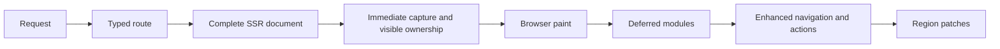

# Harch Web

[![CI][ci-badge]][ci] [![Coverage][coverage-badge]][coverage]

Harch Web is an SSR-first, progressively enhanced web architecture for Haskell. Every supported page route
returns a complete HTML document, while a deliberately small browser layer adds SPA-style navigation,
typed client actions, region patches, and live updates after the first page is already useful.

Run the smallest application from the repository root:

```sh
cabal run two-pages-example
```

Then open <http://127.0.0.1:8080/>. See [SETUP.md](SETUP.md) for development prerequisites and the
[two-pages guide](examples/two-pages/README.md) for the executable walkthrough.

## How a request becomes an application



Every supported page route is usable as HTML before the optional application runtime arrives. Native links remain
links, and modeled framework forms have an event path as soon as their controls can be used. Deferred
modules then upgrade navigation and mutations without recreating the component tree in the browser.

That design is intended to improve first-content conditions, not to promise a benchmark result. SSR
often improves First Contentful Paint by avoiding client-side data and templating round trips, but
dynamic server work can increase Time to First Byte. Measure the application and deployment that you
actually ship.

## Capability and ownership

Harch is the reusable authoring and request/response runtime. Applications choose
their domain model, identity provider, storage, retention, deployment topology,
and operations policy. The full-stack `web-api` package is deliberately a
reference application, not a list of services that Harch runs for every user.

| Area | Reusable Harch capability | Application or deployment owner |
| --- | --- | --- |
| Pages and actions | Complete SSR documents, generated/typed routes, escaping markup, typed action codecs, immediate capture, navigation, patches, and SSE. | Page data, action semantics, native-fallback choice, idempotency, and durable mutation handling. |
| Security and identity | Request limits, CSRF transport lifecycle and pluggable protection, cookie/JWT primitives, typed guards, TLS/CSP/HSTS/CORS helpers. | Credential/key loading, account/session storage, authorization policy, MFA, email delivery, and revocation rules. |
| Observability | Request policy, opaque `RequestId` ingress, telemetry-safe route observation, and OTLP/logging seams. | Collector credentials, retention, dashboards, alerting, and any durable business/security history. |
| Storage | Result-indexed database effects and PostgreSQL migration/runtime adapters. | Schema, transactions, roles, RLS, backups, capacity, retention, and the choice of PostgreSQL or another interpreter. |
| Authoring quality | Localization primitives, semantic markup, declared enhancement lifecycle, and browser-test support. | Product copy, locale catalog, visual design, accessibility review, and app-specific behavior modules. |

In particular, `web-api`'s account-activity audit is application-owned: its
`account_audit` schema, RLS roles, partition retention, capacity policy, and
`pg_cron` bootstrap are a reference deployment procedure. They are not Harch
telemetry, a generic audit API, automatic compliance, or protection from a
database owner/superuser. See the [PostgreSQL effects guide][postgres-guide]
for the concrete operational boundary and its [audit monitoring inventory](examples/postgres-effects/README.md#runtime-monitoring-and-alerting-inventory).

## How Harch differs from common rendering architectures

> **A control that looks enabled has invited interaction. If its handler does not exist yet, a real
> user can lose a click or submit—and an end-to-end test can fail for exactly the same reason.**

This is the practical hydration gap. The broader [web.dev rendering analysis][rendering-web] explains
that hydrated SSR displays server HTML and
then runs client code to add interactivity. On constrained devices, the visible page can therefore
precede the handlers that make it interactive. The inference is specific: if a visible control depends
only on a handler that hydration has not attached and has no native fallback, that control cannot yet
perform its advertised action.

### React Server Components and Next.js

React Server Component pages use Client Components where event handlers are needed. Next.js describes
the initial HTML as a non-interactive preview and says hydration attaches event handlers to make it
interactive in its [Server and Client Components guide][next-components]. It follows that an ordinary
button backed only by a Client Component handler can be visible before that handler is available.

There is an important mitigation, not a universal loss condition: Next Server Actions, built on React
Server Functions, and selected form integrations can progressively submit, redirect, queue, or replay
submissions made before hydration. See [React Server Functions][react-functions]. That protects those
modeled Server Action forms; it does not attach arbitrary client-only handlers early.

### SvelteKit

SvelteKit makes the same useful distinction. Its native [form actions][svelte-actions] work without
JavaScript and may then be progressively
enhanced. Custom client event handlers still require hydration.

A report from a SvelteKit project with 6,159 Playwright tests describes a test clicking a rendered
button before hydration, while its event handler was still unattached, producing flakiness. See
[SvelteKit discussion #13455][svelte-hydration-report]. Automation exposes
the race reliably, but a real user can reach the same enabled control during the same interval.

### Harch Web's capture contract

> Once captured by the kernel, an action remains owned and visibly pending until its handler confirms
> completion, reports a visible unresolved/recoverable outcome, or the user cancels it. Deferred behavior
> may arrive arbitrarily late without silently losing the action.

Harch does not ship a framework control until its immediate event path exists. The nonce-protected inline
kernel captures a modeled form submission and its input snapshot before the deferred action module loads,
keeps that envelope in memory, and updates only the originating control's accessible status region. A
deferred module registers a handler, claims work without removing it, and must settle the claim with its
identity; stale consumers cannot settle another handler's action. Exceptions, rejected promises, module
load errors, and actions that outlive the liveness threshold become visible recoverable states rather than
silent completion. Its rendered UTF-8 source is capped at 12 KiB by a unit-test regression budget; action
transport and region patching remain in the deferred module. Native links remain ordinary navigation.

This is a bounded ownership guarantee, not an eventual-execution or durable-delivery promise. It begins
only after the inline kernel captures the event and ends on navigation, reload, tab/browser termination,
or process failure. Time cannot distinguish slow loading from permanent failure, so the liveness threshold
changes feedback only; it never retries, submits, cancels, or transfers work. Arbitrary client-only effects
cannot have a universal native submission fallback without changing their meaning. Native submission is
therefore an explicit per-action capability, not the default; `beforeunload` is likewise an opt-in,
best-effort warning for unresolved actions, not a delivery mechanism. Retrying an indeterminate mutation
requires a stable idempotency identity and a server deduplication boundary, otherwise the action remains
visibly indeterminate rather than risking a duplicate effect.

`HandlerSafeRetry` makes a retry button available only after a recoverable handler outcome; it reclaims
the retained envelope only when a handler is present and never retries automatically. An
`IdempotentMutationRetry` additionally requires `ActionIdempotency`; the same key is retained with the
snapshot and forwarded as `Idempotency-Key` to `ClientActionRequest`, where the application must use it at
its durable deduplication boundary. The browser lifecycle test proves both attempts see the same captured
values and that an idempotent retry keeps its identity. Neither capability turns an indeterminate default
mutation into a retryable one.

An action declaring `NativeFallback` must also provide a `NativeActionFallback`: a server-owned endpoint,
its HTML form method, and the CSRF form value from that endpoint's normal server-side workflow. The browser
uses that endpoint only when JavaScript is unavailable; the capture kernel retains the codec's action path
for the enhanced request. The [example's scripts-disabled browser test][capture-e2e] posts through such a
fallback and proves its CSRF gate and complete SSR response.

Future framework event types must extend this capture contract before a corresponding enabled control
can be introduced. The [real-browser capture suite][capture-e2e] blocks the module, submits immediately,
proves input preservation without a reload, delayed handler arrival, cancellation before late registration,
handler exception/rejection/non-settlement, script-load failure, control-local multiple pending work, and
the opt-in leave warning and retry capability policy. It proves immediate capture and bounded in-document ownership—not
cross-navigation delivery or the reliability of arbitrary application effects.

### Rendering trade-offs

No rendering architecture is universally best. Harch deliberately combines a complete SSR baseline
with a narrowly scoped enhancement layer.

| Architecture | Legitimate strengths | Costs and Harch's choice |
| --- | --- | --- |
| Client-rendered JavaScript SPA | Excellent post-start navigation; can support rich offline apps. | Initial content may wait for JavaScript, data, and templating, while growing bundles can hurt FCP, TBT, and INP. Google renders JavaScript in a queue and documents limitations; other bots may not run it. [Google's JavaScript SEO guidance][google-js-seo] recommends server or prerendering. Harch sends content, links, metadata, status, and normal navigation in the first response, then enhances them. |
| Hydrated SSR framework | Better initial content than a pure SPA and access to rich client ecosystems. | It may render the application on both server and client, serialize overlapping state, ship substantial client code, and expose a pre-hydration interaction gap. Harch does not recreate its component tree in the browser; enhancement operates on declared navigation surfaces and typed regions. |
| Blazor WebAssembly | A full .NET client environment, static hosting, and offline-capable PWAs. | The browser downloads and initializes the .NET runtime, Razor components, dependencies, and assemblies; Microsoft documents larger downloads and longer component startup. Blazor Server has a smaller initial payload, but every interaction crosses the network, every browser screen owns a server circuit, and interactivity fails when the connection does. See [Microsoft's hosting comparison][blazor-hosting]. Harch needs neither a browser language runtime nor a persistent per-tab UI circuit. |
| Traditional pure SSR / multi-page app | Excellent no-JavaScript behavior, direct HTTP semantics, and crawler visibility. | Dynamic rendering can increase TTFB, and navigation or mutation normally requests and replaces a full document. Harch keeps that complete baseline while deferred navigation and typed region patches avoid routine full-page reloads. |

### Portability and alternatives

The SSR baseline, native-form fallback, capture-before-deferred-runtime rule, explicit input decoding,
and safe failure boundaries are architectural choices—not guarantees unique to Haskell. Choose the
implementation path that lets the application uphold them with acceptable opportunity cost and the
ecosystem it needs.

| Path | Closest fit and deliberate gap |
| --- | --- |
| Rust: Axum with Maud or Askama | Axum's `Form<T>` extracts URL-encoded HTML-form submissions into `Deserialize` types; Maud supplies a Rust macro HTML DSL, while Askama derives templates from typed structs with auto-escaping. Application Rust can meet an application-owned memory-safety requirement without `unsafe`, but that does not remove reviewed `unsafe`, FFI, native-library, or dependency boundaries. The app must still design native fallback, early-event capture, action dispatch, and patch envelopes. [Axum Form][axum-form] [Maud][maud] [Askama][askama] |
| Rust: Leptos actions and islands | `ActionForm` connects a typed server action to a URL-encoded POST form; it degrades to a browser submit without JS/WASM and can avoid a reload with it. It is the nearest Rust full-stack action surface, but its hydration/islands and result ownership are a different runtime model from Harch's small capture kernel and region-patch protocol. [Leptos ActionForm][leptos-action-form] |
| SvelteKit form actions | Native `POST` form actions work without JavaScript and `use:enhance` can progressively enhance them. SvelteKit supplies typed application scaffolding in TypeScript, but its client-runtime and action-result model remain distinct; it does not itself establish Harch's capture lifecycle or codec/parser-printer invariant. [SvelteKit form actions][svelte-actions] |
| Phoenix LiveView | Function components and `phx-change`/`phx-submit` forms provide a mature server-driven interactive model. Its normal interaction path is a persistent LiveView process/socket rather than Harch's request/response patch protocol, so connection-loss and runtime-failure behavior must be evaluated on that model. [Phoenix form bindings][phoenix-forms] |
| Yesod with Hamlet or Lucid | Yesod forms already pair parsing and rendering fields and expose applicative form construction; Hamlet/Lucid offer established Haskell markup paths. Adopting them trades this repository's codec/capture/patch design for their conventions and ecosystem, not for a weaker type discipline. [Yesod forms][yesod-forms] [Lucid][lucid] |

Rust macro and derive templates can retain an EDSL-like or typed template surface: Maud expands an
`html!` macro and Askama generates a `Template` implementation. Stable Rust procedural macros operate
on token streams and are unhygienic, however, so their authoring and diagnostics are not identical to
Haskell quotation and reification; that is an ergonomics comparison, not a claim that either language
is universally more expressive. [Rust procedural macros][rust-proc-macros]

None of these entries makes a throughput, latency, or memory-superiority claim. Compare real
application benchmarks, failure recovery, existing-team experience, and integration requirements. In
all cases, native dependencies, browser engines, foreign code, and transitive packages remain part of
the security and maintenance boundary.

### A smaller runtime dependency surface

The shipped browser modules have no npm dependency graph. Node is confined to Playwright and editor
tooling, application libraries are compiled into the Haskell executable rather than fetched at
startup, and the project does not use `pip`. This is a smaller exposed surface, not immunity: deployed
systems still depend on OS packages and native libraries, and the ACME image path includes the
Python-based certbot.

Recent incidents show why dependency shape deserves attention. GitHub removed more than 500
compromised npm packages during the 2025 Shai-Hulud response
([GitHub's npm security report][npm-report]).
PyPI reported more than 119,000 downloads of compromised LiteLLM versions during a 2026 exposure
window ([PyPI incident report][pypi-report]). These
are evidence-based examples, not evidence that Haskell has a measured lower attack rate.

Hackage's [`hackage-security`][hackage-security] protects its
index with The Update Framework and enables untrusted mirrors, but explicitly does not provide author
package signing. Template Haskell, custom setup code, native libraries, and build dependencies can all
execute or influence code and still require review, bounded versions, and reproducible pinning.

## Typed architecture

### Routing is generated where it can be total

The `two-pages` build hook discovers `App.Pages.*` modules and generates this closed route algebra:

```hs
data PageRoute
  = HomePage
  | LiveDataPage
  | PageNotFound
  | SecondPage
  deriving (Bounded, Enum, Eq, Show)

allPageRoutes :: [PageRoute]
allPageRoutes = [minBound .. maxBound]

pageRouteDefinition :: PageRoute -> RouteDefinition TwoPageRoute ()
pageRouteDefinition route =
  case route of
    HomePage -> App.Pages.Home.pageDefinition
    LiveDataPage -> App.Pages.LiveData.pageDefinition
    PageNotFound -> App.Pages.NotFound.pageDefinition
    SecondPage -> App.Pages.Second.pageDefinition
```

The application keeps other route families explicit:

```hs
data TwoPageRoute
  = Page PageRoute
  | Api ApiRoute
  | Custom CustomRoute
  deriving (Eq, Show)
```

The route family now determines its response capability, so the old `RequestSurface` combination is
gone. Generated static-page dispatch cannot omit a discovered page at runtime. Dynamic path parsing,
query values, API endpoints, and custom pages remain explicit, typed branches in the app router. See
[App.Routes](examples/two-pages/src/App/Routes.hs) and
[App.App](examples/two-pages/src/App/App.hs).

### Invalid states are removed at boundaries

- `Region -> RegionPatch` keeps a patch identifier and its replacement root together.
- Database operations determine their result types instead of returning one loosely typed envelope.
- Component record fields are required by their constructors and checked by the quasiquoter.
- Text and attribute escaping is centralized in the `Html` renderer; trusted HTML is a separate API.
- A single `ActionCodec target context action` owns each modeled action's target, method,
  context-aware path printer, and applicative field decoder. `ActionForm` obtains its target and method
  from that codec, preventing separately maintained form and dispatch routes from drifting.
- The action boundary distinguishes an unknown path (`404`), known path with an undeclared method
  (`405` with `Allow`), malformed matched fields (`400`), and decoded submissions rejected by ordinary
  domain validation (`422` with a safe region patch). Field parse errors contain stable constructors and
  field names, never submitted values.
- Client actions use typed responses, same-origin transport, CSRF/session boundaries, and security
  headers rather than page POSTs or full-page mutation reloads.

### Components and pages use one typed markup language

Components are ordinary functions. A record supplies named properties, a list supplies children, and
an exceptional multi-argument function can opt into positional `props`:

```hs
data AuthorCardProps = AuthorCardProps
  { authorName :: Text,
    authorRole :: Text
  }

authorCard :: AuthorCardProps -> [Html] -> Html
```

The XML-like syntax covers nullary components, dynamic named fields, nested or computed children, and
heterogeneous positional arguments:

```hs
[harch|
  <SubscriptionEmailField />

  <AuthorCard authorName={aboutAuthorName} authorRole={aboutAuthorRole}>
    <p>This is an actual HTML child.</p>
  </AuthorCard>

  <AuthorAvatar props={[AuthorIdentity "HW", CompactAvatar]}>
    <p>Two distinct typed positional values, followed by children.</p>
  </AuthorAvatar>
|]
```

The quasiquoter lowers those calls to normal Haskell: record construction such as
`authorCard (AuthorCardProps {authorName = aboutAuthorName, authorRole = aboutAuthorRole}) children`,
or the direct call `authorAvatar (AuthorIdentity "HW") CompactAvatar children`. Components produce the
`Html` AST; only
the final renderer serializes tags, centrally escaped text, and centrally escaped attributes.

Native elements lower to the same ordinary builders. For example, these two forms are equivalent:

```hs
[harch|<main lang={localeCode}><h1>{title}</h1></main>|]

element mainTag [lang localeCode]
  [element headingOneTag [] [text title]]
```

Both construct the same escaping-by-default `Html` AST: interpolation in element text becomes
`text`, interpolation in `lang` becomes the typed `lang` attribute, and only `renderHtml` turns
that AST into response text. Use the quasiquoter for ordinary page/component bodies; use the
builder form when composition is more naturally expressed as Haskell data.

Computed children are the same typed `[Html]` value in compiled quasiquoter coverage:

```hs
let computedChildren = [element paragraphTag [] [text "Computed child"]]
    computedChildrenQuoted =
      [harch|<Account.HeroCard heroTitle="Second page" children={computedChildren} />|]
```

A render prop needs no separate template subsystem. The following illustration is pseudocode only:

```hs
data ProductListProps = ProductListProps
  { products :: [Product],
    renderProduct :: Product -> Html
  }

productList props _ = fragment (map (renderProduct props) (products props))

[harch|
  <ProductList products={featuredProducts} renderProduct={productCard} />
|]
```

Haskell functions are first-class values and `Html` is safely composable, so a component can receive a
renderer and map it over a collection without framework-specific template registration.

## Guides and repository map

- [Examples](examples/README.md): a runnable-first feature ladder.
- [Runtime configuration](docs/runtime-configuration.md): environment variables, listener modes,
  security policy, assets, and OTLP settings.
- [Setup](SETUP.md): compiler, services, browser tooling, local runtime, and container workflows.
- [Design guidance](docs/design-guidance.md): read before starting Large/foundational/security-critical
  work — the pre-build decision framework, current conventions, and intentionally future-facing design.
- [Accessibility](docs/accessibility.md): semantic composition, authentication-control inventory,
  validation/focus behavior, scripts-disabled policy, and browser proof.
- [Changelog](CHANGELOG.md): release history.

The main packages are:

- `harch-web`: typed markup, site dispatch, server adapter, actions, regions, and progressive runtime.
- `web-api`: the full-stack reference application and composition root.
- `core`: shared generation, setup, and utility code.
- `test-core`: Haskell-authored unit, integration, and Playwright browser support.
- `hspec-expectations-match`: a local compatibility fork used by tests.

The project targets Linux and macOS directly. On Windows, use WSL2 or Docker with Linux containers.

### Reproducible builds and dependency upgrades

Build from the repository root with GHC **9.14.1** and cabal-install **3.16.1.0**.
The committed [`cabal.project.freeze`](cabal.project.freeze) records exact Haskell
dependency versions, solver flags, and a Hackage index timestamp (including package
metadata revisions). Cabal reads it automatically alongside `cabal.project`. Keep
dependency, repository, and index overrides out of `cabal.project.local` for
CI-equivalent or release builds.

`cabal update` refreshes the local index without upgrading the frozen plan. CI requires
the freeze file, resolves it on cache hits as well as misses, and includes it in the
Cabal cache key. Test build tools, including `hspec-discover`, belong to that plan.
Separately installed formatter tools retain the versions pinned by
`.github/scripts/install-formatting-tools.sh`.

Both Docker build paths copy the freeze file before resolving dependencies; both
runtime images retain it at `/app/cabal.project.freeze`. This pins Haskell dependency
selection, not Debian packages, container base-image digests, or bit-for-bit binaries.
Other operating systems require their own validation; this file records the Linux
CI plan, not a promise that every platform resolves identically.

To upgrade dependencies in a dedicated change:

1. Start from a clean checkout. Review the intended packages' release notes and any
   required `.cabal` bound changes, especially TLS, protocol, or public-type changes.
   Respect the complete dependency graph's published bounds. The only current
   exception is the five-pair TLS compatibility list in `cabal.project`; it exists
   because released Serialise and Cborg bounds predate GHC 9.14's `base-4.22`.
   Do not add to it, use `allow-older`, or select older metadata to evade an
   incompatibility. A proposed new exception needs an explicit compatibility
   decision and an executable source-package proof.
2. Refresh Hackage, back up the current freeze file outside the repository, then
   resolve a candidate with the freeze constraints temporarily removed:

   ```sh
   cabal update
   dependency_backup="$(mktemp)"
   cp cabal.project.freeze "$dependency_backup"
   rm cabal.project.freeze
   if ! cabal freeze --index-state=HEAD; then
     cp "$dependency_backup" cabal.project.freeze
     exit 1
   fi
   git diff -- cabal.project.freeze
   cabal build all --dry-run
   ```

   This updates the whole plan. For a focused upgrade, retain the other reviewed
   constraints and regenerate with an explicit index timestamp and the selected
   version constraints. Inspect transitive versions and flags as well as direct
   dependencies. Do not hand-label an untested plan as a passing baseline.
3. When changing TLS, Serialise, Cborg, HTTP2, or time-manager, run
   `tools/test-tls-compatibility-stack.sh`. It tests released Cborg and Serialise
   source in an isolated store, temporarily patches only Serialise's duplicate
   test orphan, cleans that store, and verifies the runtime plan still uses
   Hackage tarballs. Do not copy that patch into a runtime dependency.
   Validate changed dependencies from a fresh Cabal store and capture the build
   output for `tools/check-build-diagnostics.sh`; an existing store can hide warnings
   by skipping compilation. Run the complete local gate sequence in
   [AGENTS.md](AGENTS.md#ci-equivalent-checks), including 100% coverage and browser
   tests, with the candidate plan. Fix warnings instead of adding exemptions; the
   compatibility script is the sole package-version-specific GHC 9.14 exception.
4. Commit the reviewed manifest/freeze changes and any required adaptations together.
   Before release, require successful CI for that exact full commit SHA, including
   the PR's required checks. Keep an unrelated fixture fix in a separate commit.

CI creates a `tested-source-packages` artifact only after the build, coverage,
formatting, and browser gates pass. It contains `packages/*.tar.gz` from `cabal sdist`,
the freeze file, `COMMIT`, and `repository.tar.gz` with the complete source and frozen
project. For a package release, publish those tested package tarballs and retain the
matching artifact as build provenance. For a container release, build the chosen
Docker target from that exact repository archive or commit, retaining its freeze file.
There is currently no automatic Hackage or container-registry publishing workflow.

Hackage source packages expose their declared library dependency bounds; a consuming
application does **not** inherit this repository's freeze file. To reproduce our
build, unpack `repository.tar.gz` and run Cabal there. Do not tighten public library
bounds to exact transitive versions merely to reproduce a repository build. See
[Cabal's freeze documentation](https://cabal.readthedocs.io/en/stable/cabal-commands.html#cabal-freeze).

## Find a real example

The map below distinguishes a reusable capability from the application or
deployment decisions that surround it. “Reference” means source and tests are
present in this repository; it is not a promise that the framework supplies
the surrounding product policy.

| Need | Owner and evidence | Start here | Important limitation or prerequisite |
| --- | --- | --- | --- |
| SSR, captured actions, patches, enhanced navigation, and SSE | Harch runtime; runnable `two-pages` source and browser suite. | [two-pages guide](examples/two-pages/README.md), [browser proof][capture-e2e] | Native fallback is explicit per action; capture is bounded in-document ownership, not durable delivery. |
| Typed routes, route families, and composed modules | Harch routing/module APIs; `two-pages`, `custom-api`, and `composed-domains` reference tests. | [routing overview](#typed-architecture), [custom API guide](examples/custom-api/README.md) | Dynamic route-template syntax remains [design direction](examples/route-templates/README.md), not an executable DSL. |
| Page-scoped browser behavior | Harch runtime assets and declared enhancements; `two-pages` source/test. | [custom JavaScript guide](examples/custom-js/README.md) | Application code owns its behavior module and must retain complete SSR fallback. |
| Accessibility, language selection, and localization | Semantic markup/localization APIs; localized reference pages and browser proof. | [accessibility](docs/accessibility.md), [localization guide](examples/multilanguage-routing/README.md) | The language picker and Help FAB are reference-app controls, not a general Harch widget library. |
| Sessions, CSRF, authentication adapters, and protected routes | Harch transport/guard primitives; `web-api` and admission examples wire application stores. | [authentication guide](examples/middleware-auth-jwt/README.md) | Credential persistence, MFA policy, authorization, and screen locking are application-owned; screen locking is documented, not implemented. |
| Request correlation and telemetry | Harch `RequestId`, trusted route observation, and OTLP seams; `web-api` integration coverage. | [request-id source](packages/harch-web/src/HarchWeb/RequestId.hs), [telemetry guide](examples/logging-and-telemetry/README.md) | The framework correlation foundation is landed; the remaining response/log/span/audit join sweep is tracked in AHI-5-RID. |
| Database effects and migrations | Harch database effect contract; `web-api` PostgreSQL adapter and a non-PostgreSQL test adapter. | [PostgreSQL effects guide][postgres-guide], [custom adapter guide](examples/custom-db-adapter/README.md) | Schema, roles, retention, transaction policy, and connection credentials belong to the application/deployment. |
| Account-activity audit operations | `web-api` reference schema, atomic session/audit operation, RLS, partition maintenance, and scheduler bootstrap. | [PostgreSQL effects guide][postgres-guide], [audit migration source](packages/web-api/src/WebApi/Postgres/ActivityAuditMigration.hs) | Operator/reporting only; no customer-facing audit API, no automatic SOC compliance, and no superuser-tamper resistance. |
| TLS, proxy, and deployment hardening | Harch listener/security configuration; executable setup and integration tests. | [setup](SETUP.md), [HTTPS security guide](examples/https-security/README.md), [proxy guide](examples/reverse-proxy-awareness/README.md) | Certificates, DNS, external reachability, secrets, and production policy remain deployment responsibilities. |

The [examples index](examples/README.md) labels each guide as executable,
implemented/tested, workflow-only, or proposed design so a snippet is never
mistaken for a shipped API.

[ci-badge]: https://github.com/gorban/haskell-web-api/actions/workflows/ci.yml/badge.svg
[ci]: https://github.com/gorban/haskell-web-api/actions/workflows/ci.yml
[coverage-badge]: https://img.shields.io/badge/package_coverage-100%25-brightgreen
[coverage]: https://gorban.github.io/haskell-web-api/
[rendering-web]: https://web.dev/articles/rendering-on-the-web
[next-components]: https://nextjs.org/docs/app/getting-started/server-and-client-components
[react-functions]: https://react.dev/reference/rsc/server-functions
[svelte-actions]: https://svelte.dev/docs/kit/form-actions
[axum-form]: https://docs.rs/axum/latest/axum/struct.Form.html
[maud]: https://maud.lambda.xyz/
[askama]: https://docs.rs/askama/latest/askama/
[leptos-action-form]: https://book.leptos.dev/progressive_enhancement/action_form.html
[phoenix-forms]: https://phoenix-live-view.hexdocs.pm/form-bindings.html
[yesod-forms]: https://www.yesodweb.com/book/forms
[lucid]: https://hackage.haskell.org/package/lucid
[rust-proc-macros]: https://doc.rust-lang.org/reference/procedural-macros.html
[svelte-hydration-report]: https://github.com/sveltejs/kit/discussions/13455
[capture-e2e]: examples/two-pages/test/E2E/AppSpec.hs
[google-js-seo]: https://developers.google.com/search/docs/crawling-indexing/javascript/javascript-seo-basics
[blazor-hosting]: https://learn.microsoft.com/en-us/aspnet/core/blazor/hosting-models?view=aspnetcore-10.0
[npm-report]: https://github.blog/security/supply-chain-security/our-plan-for-a-more-secure-npm-supply-chain/
[pypi-report]: https://blog.pypi.org/posts/2026-04-02-incident-report-litellm-telnyx-supply-chain-attack/
[hackage-security]: https://hackage.haskell.org/package/hackage-security
[postgres-guide]: examples/postgres-effects/README.md
